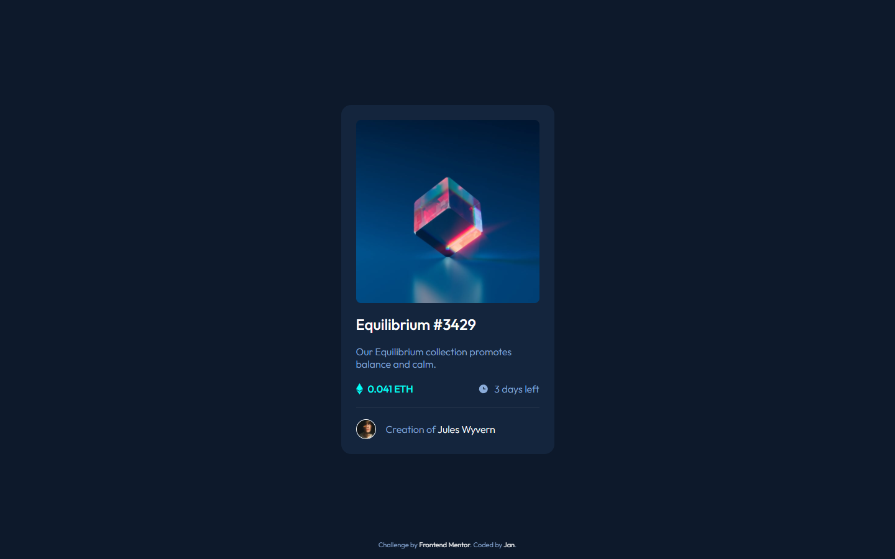
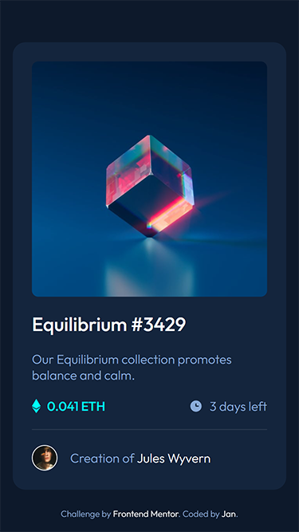
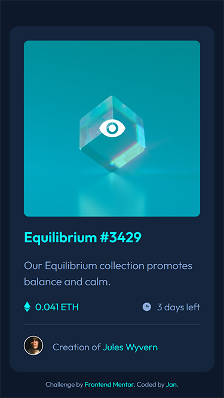
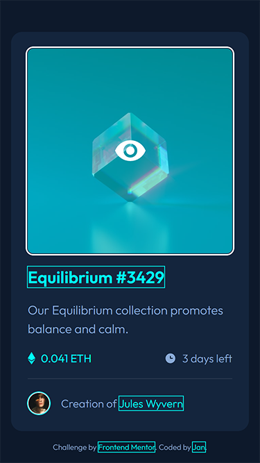

# Frontend Mentor - NFT preview card component solution

This is a solution to the [NFT preview card component challenge on Frontend Mentor](https://www.frontendmentor.io/challenges/nft-preview-card-component-SbdUL_w0U). Frontend Mentor challenges help you improve your coding skills by building realistic projects. 

## Table of contents

- [Overview](#overview)
  - [The challenge](#the-challenge)
  - [Screenshot](#screenshot)
  - [Links](#links)
- [My process](#my-process)
  - [Built with](#built-with)
  - [What I learned](#what-i-learned)
  - [Useful resources](#useful-resources)
- [Author](#author)
- [Acknowledgments](#acknowledgments)

## Overview

### The challenge

Users should be able to:

- View the optimal layout depending on their device's screen size
- See hover states for interactive elements

### Screenshot

|  |  | | |
| ------- | -------| -------| ------|
| Desktop | Mobile | Hover  | Focus |

### Links

- Solution URL: [Github Repo](https://github.com/Negligence/nft-preview-card-component.git)
- Live Site URL: [Github Pages](https://negligence.github.io/nft-preview-card-component/)

## My process

### Built with

- Semantic HTML5 markup
- CSS custom properties
- CSS Grid
- Mobile-first workflow

### What I learned
I used figure and figcaption here to pair images and texts together. Feel free to send me feedback if my tag usage is incorrect.

```html
<figure class="crypto-currency">
  
  <figcaption>0.041 ETH</figcaption>
</figure>

<figure class="sale-duration">
  
  <figcaption>3 days left</figcaption>
</figure>

<figure class="creator">
  <a href="#"></a>
  <figcaption>Creation of <a href="#">Jules Wyvern</a></figcaption>
</figure>
```

Kept classes to a minimum and used Descendant, Direct Child, and :first-child selectors to style.

```css
body {
  background: var(--very-dark-blue-main-bg);
  height: inherit;
  display: grid;
  place-content: center;
}

article {
  background: var(--very-dark-blue-card-bg);
  max-width: calc(375px - 2rem);
  padding: 1.5rem;
  display: grid;
  gap: 1.2rem;
  border-radius: 1rem;

}

div, figure, .card-img {
  display: grid;
  grid-auto-flow: column;
  align-items: center;
}

.card-img > :first-child {
  border-radius: 0.5rem;
  width: 100%;
  grid-area: 1 / 1 / 1 / 1;
}

.crypto-currency img {width: 11px;}
.sale-duration img {width: 18px;}
.creator img {
  width: 32px;
  border: 1px solid white;
  border-radius: 50%;
}

p {font-size: 1.125rem; line-height: 1.5em;}


div {justify-content: space-between;}

.crypto-currency,
.sale-duration {column-gap: 0.5rem;}

.creator {
  grid-template-columns: min-content auto;
  column-gap: 1rem;
}

hr {
  border-width: 0 0 1px 0;
  border-color: rgba(255, 255, 255, 0.1);
}

footer {
  font-size: 0.6875rem;
  position: fixed;
  inset: auto 0 1rem;
  text-align: center;
}

footer a,
h1 a,
.creator a {
  color: white;
  text-decoration: none;
}
```

In addition to the :hover styles, I also added :focus styles for keyboard navigation.

```css
.card-img > img + img {
  grid-area: 1 / 1 / 1 / 1;
  place-self: center;
  color: white;
  font-size: 50px;
  z-index: 1;
  transform: scale(1, 0);
}

.card-img:hover > img + img,
.card-img:focus > img + img {
  transform: scale(1, 1);
  transition: transform 150ms ease-in-out;
}

.card-img {
  position: relative;
}

.card-img:hover::after,
.card-img:focus::after{
  content: '';
  background-color: var(--cyan);
  opacity: 50%;
  position: absolute;
  inset: 0;
  border-radius: 0.5rem;
}

h1 a, .creator a{transition: color 300ms ease-in-out;}

h1 a:hover,
h1 a:focus,
.creator a:hover,
.creator a:focus,
footer a:hover,
footer a:focus {
  color: var(--cyan);
}

.creator > a:focus {
  height: 32px;
  border-radius: 50%;
}

h1 a:focus,
.creator a:focus,
footer a:focus {
  outline: 1px solid var(--cyan);
}

.card-img:focus-visible {
  outline: 2px solid white;
  border-radius: 0.5rem;
}
```

### Useful resources

- [Create a responsive navigation nav with no JS!](https://www.youtube.com/watch?v=8QKOaTYvYUA&t=1718s&ab_channel=KevinPowell) - I got the transform:scale() trick from this video.

## Author

- Frontend Mentor - [@Negligence](https://www.frontendmentor.io/profile/Negligence)
- Github - [Negligence](https://github.com/Negligence)
- Twitter - [@IEImNothing](https://twitter.com/IEImNothing)
- Twitch - [Arrogant_Negligence](https://www.twitch.tv/arrogant_negligence)
- Youtube - [Jan Panado](https://www.youtube.com/channel/UC4ojhHYmkHptu2JpyKtrL-w)
- LinkedIn - [Jan Panado](https://www.linkedin.com/in/janp-09/)
- Facebook - [Jan Panado](https://www.facebook.com/jan.panado)
- Website - [Jan Panado](https://jan-panado.com/)

## Acknowledgments

Shout out to [Kevin Powell](https://www.youtube.com/kepowob), a lot of his videos gave me ideas on using direct child and sibling CSS selectors.
